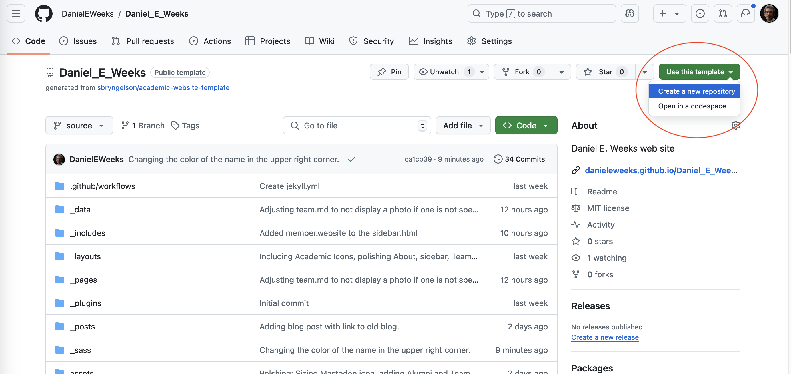
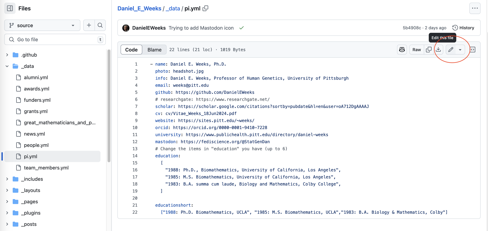
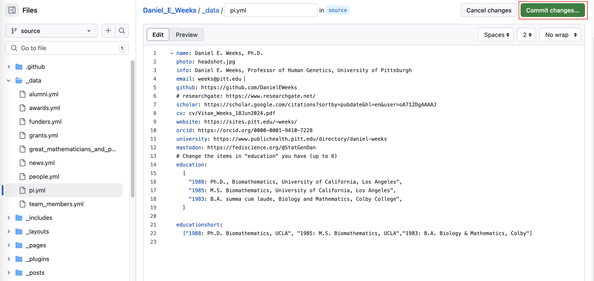

# Constructing a Research Group Website

Here's a nice one from today's Biostats Seminar speaker that looks like it works well both on desktop computers and on my cell phone: 

     <https://mzhanglab.github.io/>	  

It uses this template code: 

<https://github.com/sbryngelson/academic-website-template>

I started with this template code, but it has subsequently been customized and
extended as described below.  Note also that I have turned off some features, so
look at the two websites above if you want to turn them on again. 

# Step 0: Create a GitHub account

Create a GitHub account at <https://github.com/>.

While it is not necessary to sign up for GitHub Education for Teachers, if you end up using GitHub a lot, you should consider signing up - see

<https://docs.github.com/en/education>

for further information.


# Step 1: Copy the template to your own GitHub account

Log into GitHub in your web browser.

Go to 

<https://github.com/DanielEWeeks/Daniel_E_Weeks>

and click the "Use this template" button and choose the 'Create a new repository' option.

 

The code there generates this web site:

<https://danieleweeks.github.io/Daniel_E_Weeks/>

# Step 2: Turn on the GitHub Action

To get it to generate a GitHub Pages website, I then had to follow the instructions here:

<https://jekyllrb.com/docs/continuous-integration/github-actions/>

to change the 

Build and deployment

Source

to 'GitHub Actions'  

using the Deploy Jekyll site to Pages workflow. 

This should automatically update the github.io website after each update is committed (see below for how to make and commit changes).  


# Step 3: Customize the information

The majority of the customization can be done by editing *.yml and *.md text files, and by copying desired image files into the 'images' folder, copying an updated CV into the 'cv' folder, etc.   

However, some of the customizations required using some HTML (For example, see the Syllabus button links in _pages/teaching.md or the publication search links at the start of _pages/publications.md).  Some of these links were copied from my Department of Human Genetics faculty page. 

To customize it with my own information, I had to modify these files and update some image files.  Initially I changed these, but yet more modifications may be
needed to fully customize it:

```	 
   _config.yml
   _data/funders.yml
   _data/pi.yml
   _data/news.yml
   _pages/home.md
   images/DanWeeks_WordCloud.png
   images/headshot.jpg
   _pages/teaching.md
   _pages/publications.md 
   _data/grants.yml 
   _data/awards.yml 
```

**Example**

To edit the _data/pi.yml in the online GitHub.com interface, click on it, and then click on the pencil icon on the upper right to edit this file:



After making the desired changes, then save them by clicking the green 'Commit changes...' button:



If the GitHub Action 'Deploy Jekyll site to Pages workflow' is properly turned on and functioning, after every commit, your github.io web page should automatically be updated with your latest committed changes.  Note that these updates can sometimes take a little while, as your whole website is being re-generated.

**Important:** When editing the *.yml files, make sure the keywords start in column 3.  This software system fails with a cryptic error message if the keywords are not indented properly. 

Note that the *.yml and *.md files are text files that can be edited online in the GitHub.com website.  The image files can be also added into the appropriate folder in the online interface. 

To add my cv, I made a 'cv' folder, and then copied a PDF of my CV into that folder.  I then edited the 'cv' line in _data/pi.yml as needed.

To customize the listed software, I edited _pages/software.md 

**Turned off pages and adjusted page order**

In _config.yml I turned off some of the pages, like the blog, by putting a hash # sign in front of the line listing them.  I also rearranged the order of the pages.

Note that I edited the _config.yml to turn off these three pages:

```
# - name: talks
# - name: research
```

If you wish to have these pages in your web site, remove the hash # sign and then edit accordingly. 

**Customizing References**

Generated a BibTex-formatted set of references from my Zotero database, and pasted them into the assets/ref.bib file.

If the LaTeX tag for the article contains a dash '-' in it, then the BIB and ABSTRACT pop-ups do not work. To get those to work, I had to remove the dashes.

For example, this does not work

@article{treble-barna_brain-derived_2023

but this works

@article{treblebarna_brainderived_2023


As I don't have many conference proceedings, I deleted this

```
<div class="jumbotron">
### Refereed conference proceedings

</div>
```

from _pages/publications.md 

*Preprints:* If the BibTex entry starts with the

@unpublished{}

tag instead of @article{}, it will be listed in the Preprints section of the Publications page.


**Customizing Academic Icons**

To add an ORCiD academic icon, I had to import the css for

<https://jpswalsh.github.io/academicons/>  

into _includes/head.html, and then adjust accordingly in 

```
_includes/sidebar.html
_pages/about.md
_pages/team.md
```

After these adjustments, then changing the ORCiD link only requires you adjust the 'orcid' line in _data/pi.yml:  

orcid: https://orcid.org/0000-0001-9410-7228

**Customizing favicon.ico**

I put my own favicon.ico in the root directory - this is the little icon that appears in the upper right of the web page.

Pitt has University of Pittsburgh favicon.ico files, but we are only permitted to use them on web sites that end in *.pitt.edu. 

I think if you don't have a favicon.ico that you'd like to use, you can probably simply delete it.  

  


# Generated web site

My generated web site is here:

<https://danieleweeks.github.io/Daniel_E_Weeks/>


# Font Awesome

For the link icons, this uses Font Awesome version 4.2.0.


# Blog posts

To make a blog post, put a *.md Markdown file in the _posts folder.

It has to have a header like this at the beginning:

```
---
layout: post
title: "Font Awesome Icon List"
date: 2024-11-02
categories: "Examples"
---
```

And then the name of the *.md Markdown file has to start with the date, like this:

2024-11-02-font-awesome.md


# About page

Note that I commented out the 'Students and Mentoring' section, which is driven by the _data/people.yml file.  To turn it back on, remove the

```

```

and

```

```

lines. 

# Navbar background color and Name color

To set the navigation bar background color to blue from black, I changed this line of _sass/bootstrap.scss (where '-' marks the original line, and '+' marks the updated line):
 
```
 .bg-dark {
-  background-color: #303030 !important;
+  background-color: #003594 !important;
 }
```

To change the color of the name in the upper right corner in the desktop view, I made these changes:

```
 .navbar-dark .navbar-brand {
-  color: #fff;
+  color: #FFB81C;
 }
 
 .navbar-dark .navbar-brand:hover, .navbar-dark .navbar-brand:focus {
-  color: #fff;
+  color: #FFB81C;
 }
```
